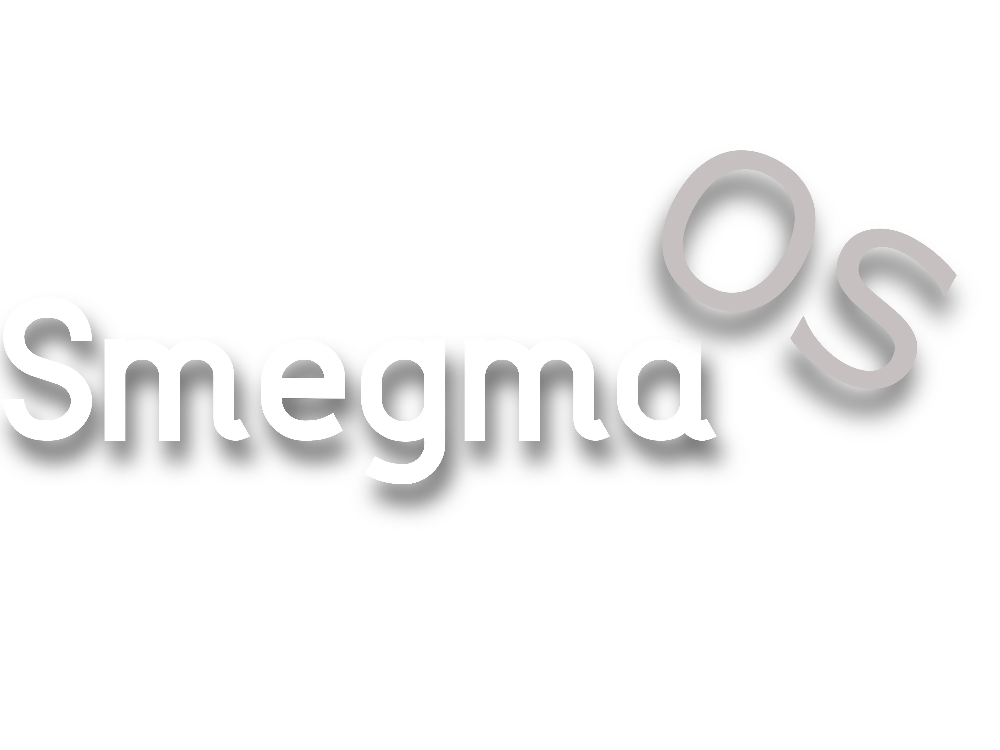

# Smegma-OS

Smegma-OS is a GNU/Linux distribution, based on [Linux From Scratch](https://linuxfromscratch.org/), with some modifications.

## Package managment

Smegma-OS will use a custom package manager, [Fempkg](https://github.com/Sugaryyyy/Fempkg), a custom made source based package manager based on femboy semen.
## Our team analyzing the femboys

> [Tiny thing that doesnt matter]
> Smegma-OS is very much in development, and shouldn't be used as a daily driver. Expect errors and kernel panics. You have been warned.
